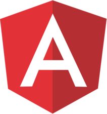

<div align="center">
  <a href="https://www.telerik.com/kendo-angular-ui/"></a>
  &nbsp;&nbsp;&nbsp;
  <a href="https://angular.io/"></a>
</div>

<h1 align="center">Finance Portfolio — Kendo UI for Angular</h1>

<p align="center">
  A finance prototype application built with <a href="https://www.telerik.com/kendo-angular-ui/components">Kendo UI for Angular</a>, showcasing interactive data visualization and rich UI components.
  <br />
  <a href="https://telerik.github.io/kendo-angular/finance-portfolio"><strong>View Live Demo »</strong></a>
</p>

---

## Components Used

| Component | Docs |
|-----------|------|
| Grid | [Grid Component](https://www.telerik.com/kendo-angular-ui/components/grid/) |
| Charts | [Charts](https://www.telerik.com/kendo-angular-ui/components/charts/) |
| DateInputs | [DateInputs](https://www.telerik.com/kendo-angular-ui/components/dateinputs/) |
| DropDowns | [DropDowns](https://www.telerik.com/kendo-angular-ui/components/dropdowns/) |
| Splitter | [Splitter Component](https://www.telerik.com/kendo-angular-ui/components/layout/splitter/) |
| Buttons | [Buttons](https://www.telerik.com/kendo-angular-ui/components/buttons/button/) |
| Theme | [Kendo Theme Bootstrap](https://www.telerik.com/kendo-angular-ui/components/styling/theme-bootstrap/) |

---

## Getting Started

> The sample project runs with the [currently supported Angular version](https://www.telerik.com/kendo-angular-ui/components/installation/requirements/#toc-angular).

```bash
# 1. Clone the repository
git clone https://github.com/telerik/kendo-angular.git

# 2. Navigate to the project folder
cd examples-standalone/finance-portfolio

# 3. Install dependencies
npm install
```

## Development Server

```bash
ng serve
```

Navigate to `http://localhost:4200/`. The app reloads automatically when source files change.
